# 📈 Simple Linear Regression — Theory and Mathematical Derivation

## Problem Statement

We are building a Machine Learning model to predict **Sales** based on **TV advertising spend**.

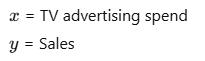

Our goal is to find the best-fitting straight line that predicts sales from TV spend.

---

## 1️⃣ Simple Linear Regression Model

We assume a linear relationship between input and output:

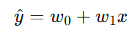

Where:

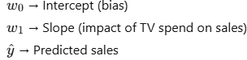

For a dataset of \( n \) observations:

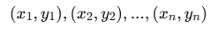

Our objective is to determine optimal values of

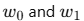

---

## 2️⃣ Residuals (Errors)

For each data point:

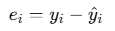

Substituting the model:

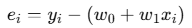

The residual represents the vertical distance between the actual value and predicted value.

---

## 3️⃣ Residual Sum of Squares (RSS)

To avoid cancellation of positive and negative residuals, we square them:

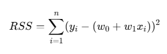

This is the objective function we want to minimize.

---

## 4️⃣ Mean Squared Error (MSE)

The average squared error:

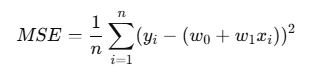

MSE provides a scale-independent measure of error.

---

## 5️⃣ Root Mean Squared Error (RMSE)

Since MSE has squared units, we take the square root:

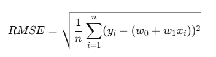

RMSE is interpreted as the average prediction error in the original unit (sales).

---

## 6️⃣ Matrix Representation

Instead of scalar form, we express the model using matrices.

### Define Matrices

Target vector:

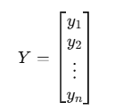

Design matrix:

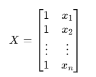

Weight vector:

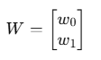

Model equation:

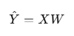

---

## 7️⃣ RSS in Matrix Form

Residual vector:

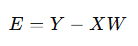

RSS becomes:

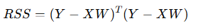

This is equivalent to summing squared residuals.

---

## 8️⃣ Derivation of the Normal Equation

Expand:

Take derivative with respect to 𝑊

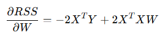

Set equal to zero:

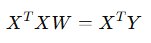

Solve:

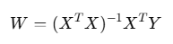

This is called the **Normal Equation**.

---

## 9️⃣ What This Code is Doing (Conceptually)

1. Load dataset
2. Split into train and test sets
3. Convert scalar form to matrix form
4. Apply:
   
5. Predict:
   
6. Evaluate using RMSE
7. Plot residuals to validate assumptions

---

This project demonstrates the complete theoretical foundation and mathematical derivation behind Simple Linear Regression.
